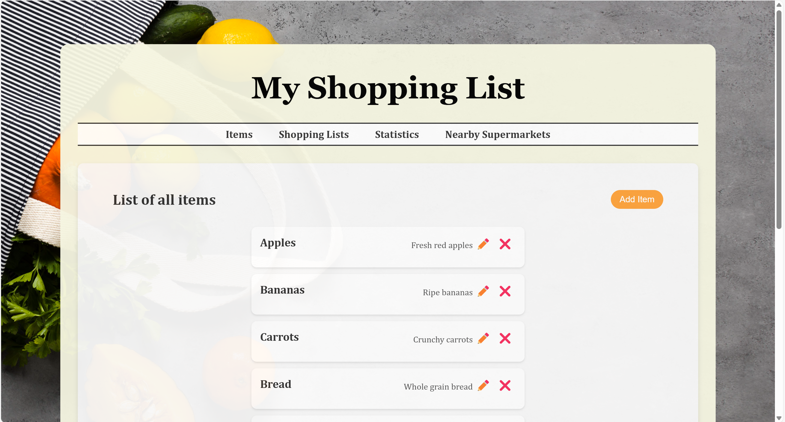
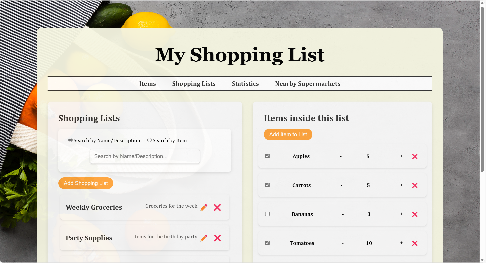
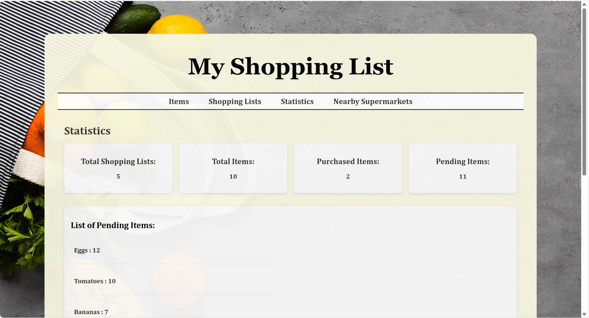
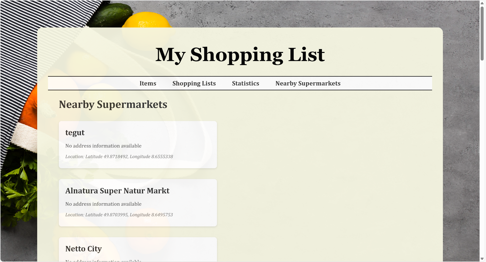

# FWE-WS-24-25-772829 Shopping List App

This repository contains a shopping list management application with a **Node.js** backend using **Express**, **MongoDB**, and **TypeScript**, and a **React** frontend using **TypeScript**. The application includes full CRUD operations for managing shopping lists, items, and their statuses.




## Table of Contents
1. [Prerequisites](#prerequisites)
2. [Installing](#installing)
3. [Running the Application](#running-the-application)
4. [API Documentaion](#api-documentation)
4. [Testing](#testing)
5. [Freestyle Tasks](#freestyle-tasks)

## Prerequisites

To run this project, you need to have the following software installed on your system:

- Node.js
- npm (Node Package Manager)
- MongoDB

You can download and install Node.js and npm from the [Node.js official site](https://nodejs.org/). MongoDB can be installed from [MongoDB's official site](https://www.mongodb.com/try/download/community).

## Installing

Follow these steps to set up your development environment:

1. Clone the git repository:
    ```bash
    git clone https://code.fbi.h-da.de/sthgngu2/fwe-ws-24-25-772829.git
    ```

2. Install the necessary packages for the project:
    ```bash
    npm install
    ```

3. Navigate to the frontend directory and install the necessary packages:
    ```bash
    cd src/frontend
    npm install
    ```

4. Navigate back to the root directory of the repository:
    ```bash
    cd ../../
    ```
  
## Running the Application

If you want to help some data to play with, do not forget to seed the database:
```bash
npm run seed
```

To start both the backend and frontend servers, run the following command from the root directory of the repository:
```bash
npm run start
```

The backend will be available at [http://localhost:5000](http://localhost:5000).  
The frontend will be available at [http://localhost:3000](http://localhost:3000).

Make sure that you have the ports free.

## API Documentation

### Endpoints

#### Items

- **GET /api/items**: Retrieves all items.
- **POST /api/items**: Creates a new items.
- **GET /api/items/:id**: Retrieves a specific item by ID.
- **PATCH /api/items/:id**: Updates a specific item by ID.
- **DELETE /api/items/:id**: Deletes a specific item by ID.

#### Shopping Lists 

- **GET /api/shoppingLists/**: Retrieves all shopping lists.
- **GET /api/shoppingLists/:id**: Retrieves a specific shopping list by its unique id.
- **POST /api/shoppingLists/**: Creates a new shopping list with the provided details.
- **PATCH /api/shoppingLists/:id**: Updates an existing shopping list identified by its unique id.
- **DELETE /api/shoppingLists/:id**: Deletes a specific shopping list identified by its unique id.
- **GET /api/shoppingLists/search**: Retrieves shopping lists based on search criteria (e.g., by name or description).
- **GET /api/shoppingLists/item/:itemId**: Retrieves all shopping lists that contain a specific item.

#### Shopping List Items

- **POST /api/shoppingListItems/:shoppingListId**: Adds an item to the shopping list identified by shoppingListId.
- **DELETE /api/shoppingListItems/:shoppingListId/:itemId**: Removes an item identified by itemId from the shopping list identified by shoppingListId.
- **PATCH /api/shoppingListItems/:shoppingListId/:itemId/status**: Updates the purchase status of an item identified by itemId in the shopping list identified by shoppingListId.
- **PATCH /api/shoppingListItems/:shoppingListId/:itemId/quantity**: Updates the quantity of an item identified by itemId in the shopping list identified by shoppingListId.
- **GET /api/shoppingListItems/:shoppingListId**: Retrieves all items in the shopping list identified by shoppingListId.

#### Statistics

- **GET /api/statistics/totalShoppingLists**: Returns the total number of shopping lists.
- **GET /api/statistics/totalItems**: Returns the total number of unique items.
- **GET /api/statistics/purchasedItems**: Returns the total number of purchased items.
- **GET /api/statistics/pendingItems**: Returns the total number of pending items.
- **GET /api/statistics/pendingItemsList**: Returns a list of pending items with aggregated quantities.

#### Nearby Supermarkets

- **GET /api/nearby-supermarkets**: Returns a list of nearby supermarkets

### Data Models

#### Item

- `name`: string
- `description`: string

#### Shopping List

- `name`: string
- `description`: string
- `createdAt`: Date

#### Shopping List Item
- `shoppingListId`: string
- `itemId`: string
- `quantity`: number
- `status`: boolean
  
## Testing

The project includes automated tests for the backend using Jest. To run the tests, use the following command:

```bash
npm run test:all
```

The tests cover the main functionality of the application, including creating, retrieving, updating, and deleting items, shopping lists and items in shopping lists. In addition, tests for statistics are also considered

## Freestyle Tasks
### Freestyle Task #1



Feature: Statistics

#### Description: 
The Statistics feature provides users with an intuitive dashboard that summarizes key metrics about their shopping lists and items. It delivers insights into user behavior and highlights actionable information such as pending purchases.

#### The statistics dashboard includes four main metrics:

- **Total Shopping Lists**: Displays the total number of shopping lists created.
- **Total Items**: Shows the cumulative count of all items added across shopping lists.
- **Purchased Items**: Indicates the total number of items marked as purchased.
- **Pending Items**: Reflects the number of items still marked as pending in all shopping lists.

#### Pending Items Breakdown:

- Provides a detailed breakdown of all pending items grouped by their names.
- Aggregates the total quantity for each item across all shopping lists to help users identify high-priority items they still need to purchase.

#### API Endpoint
Provided [above](#statistics)

### Freestyle Task #2



Feature: Finding Nearby Supermarkets 

#### Description: 
The Fingding Nearby Supermarkets feature allows users to easily locate supermarkets close to their current location. This feature enhances the shopping experience by guiding users to the nearest stores, ensuring convenience and time-saving when shopping for items on their lists.

#### Extern API
It uses the **Overpass API** to query OpenStreetMap data for supermarkets within a specified radius of a given latitude and longitude.

#### User Location Access
The feature to find nearby supermarkets relies on obtaining the user's current geographic location. This is achieved by using the browser's built-in geolocation API, which can provide the user's latitude and longitude.

To get accurate results, users need to **allow location access** when prompted. If they deny access, the feature will not function as intended.

#### Drawbacks
- **Data Accuracy**: The quality and completeness of the data returned by the Overpass API depend on OpenStreetMap contributors. Some supermarkets may lack detailed information, such as the address or accurate location.
- **Response Time**: Since the Overpass API pulls data from OpenStreetMap, the response time can vary depending on server load and network conditions. 

#### API Endpoint
Provided [above](#nearby-supermarkets)


